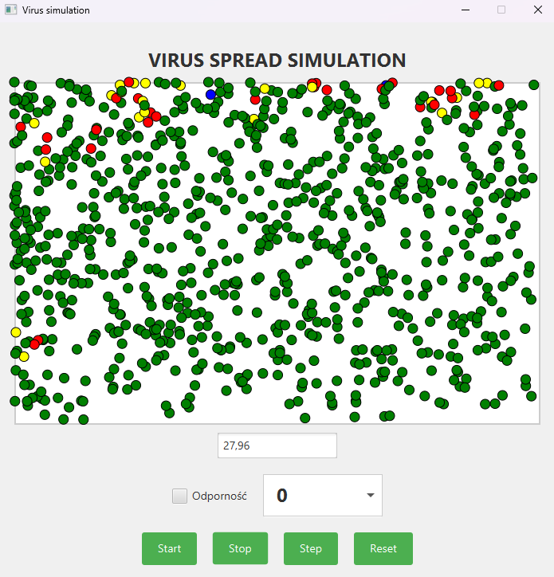

# Virus Simulation 🦠

This project, developed in JavaFX, presents a simulation of virus spread within a defined area. It features dynamic units (individuals) that move around and can exist in various states: healthy, infected with symptoms, asymptomatic, or immune. The simulation incorporates the Memento design pattern, enabling users to save and restore the state of the simulation at any point in time, providing full control and the ability to analyze different scenarios.

  

